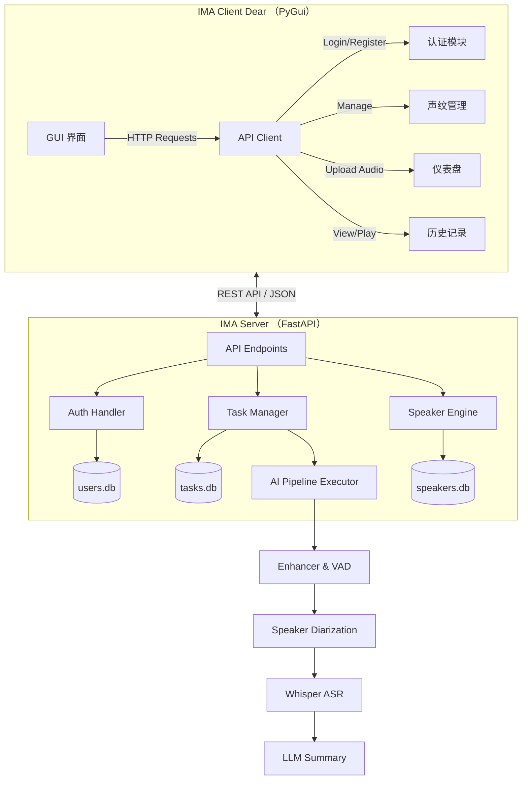
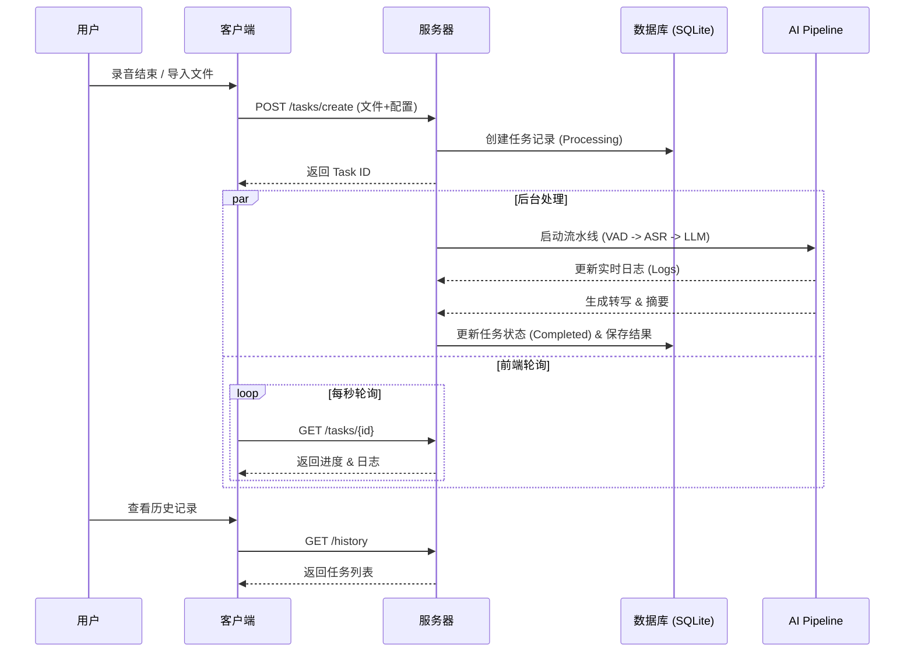

# 🎙️ Intelligent Meeting Assistant (IMA) Net - v1.8.1

**IMA Net** 是一个基于 **Client-Server (C/S) 架构** 的全流程智能会议分析系统。

相较于旧的单机版本，v1.8.1 引入了完整的**前后端分离**设计，支持多用户协作、基于角色的权限控制 (RBAC)、任务历史持久化存储以及远程音频回放。它集成了声纹识别、语音转写 (Whisper) 和 LLM (DeepSeek/Ollama) 智能摘要功能。

---

## 🌟 核心特性 (Key Features)

### 🏗️ 架构升级

* **前后端分离**:
* **Server**: 基于 **FastAPI** 的高性能后端，负责 AI 流水线处理、数据库管理和 API 响应。
* **Client**: 基于 **Dear PyGui (DPG)** 的轻量级客户端，提供流畅的可视化操作。


* **任务持久化**: 使用 **SQLite** 数据库记录所有历史任务，支持随时回看会议纪要、转写全文和重听原始录音。

### 🔐 权限与用户管理 (User & Security)

* **RBAC 权限系统**:
* **Admin (管理员)**: 拥有最高权限，可管理声纹库、删除用户、重置任意用户密码。
* **User (普通用户)**: 仅可查看声纹列表、创建任务、查看自己的历史记录。


* **JWT 鉴权**: 所有敏感接口均受 JWT Token 保护。

### 🧠 AI 流水线 (AI Pipeline)

* **音频增强**: 降噪与 VAD (语音活动检测)。
* **声纹识别**: 结合 `SpeakerDB`，自动识别“谁在说话”（如：`产品经理 Alice: ...`）。
* **智能摘要**: 支持多种 LLM 后端，生成结构化 Markdown 会议纪要。

---

## 🛠️ 系统架构 (System Architecture)

### 1. 整体交互图



### 2. 任务处理流程



---

## 📂 项目结构 (Project Structure)

```text
IMA_Net/
├── IMA_Server/                 # === 后端根目录 ===
│   ├── app/
│   │   ├── main.py             # FastAPI 入口，定义所有 API 路由
│   │   ├── auth.py             # 用户认证、JWT 生成、数据库操作 (UserDB)
│   │   └── task_manager.py     # 任务管理、状态轮询、历史记录 (TaskDB)
│   ├── core/                   # 核心流水线逻辑
│   │   ├── processors.py       # 各个 AI 节点的具体实现类
│   │   └── executor.py         # 管道执行器
│   ├── utilities/              # 底层 AI 引擎
│   │   ├── ASR/                # Whisper 封装
│   │   ├── diarization/        # 声纹识别与数据库
│   │   └── meeting_extractor/  # LLM 摘要提取
│   └── resource/               # [自动生成] 存储数据库、上传文件、模型
│       ├── users.db            # 用户数据库
│       ├── tasks.db            # 任务历史数据库
│       └── uploads/            # 音频文件存储
│
└── IMA_Client/                 # === 客户端根目录 ===
    ├── main.py                 # GUI 入口，主循环
    ├── client_core/
    │   ├── api_client.py       # 封装 requests 请求
    │   ├── app_state.py        # 全局状态 (用户信息、字体等)
    │   ├── ui_utils.py         # 字体加载与 UI 辅助
    │   └── components/         # UI 组件模块
    │       ├── dashboard.py    # 仪表盘 (录音、任务进度)
    │       ├── history_mgr.py  # 历史记录 & 音频回放
    │       ├── speaker_mgr.py  # 声纹管理 (Admin)
    │       ├── user_mgr.py     # 用户管理 (Admin)
    │       └── node_editor.py  # 管道节点编辑器
    └── config/                 # 客户端配置文件

```

---

## 📡 API 接口文档 (API Documentation)

### 1. 认证与用户 (Authentication & Users)

| 方法 | 路径 | 权限 | 描述 |
| --- | --- | --- | --- |
| `POST` | `/auth/register` | Public | 用户注册。`invite_code="IMA_ADMIN_2025"` 可注册管理员。 |
| `POST` | `/auth/login` | Public | 登录，获取 JWT Token。 |
| `POST` | `/auth/password` | Login | 修改当前登录用户的密码。 |
| `GET` | `/users` | **Admin** | 获取所有用户列表。 |
| `DELETE` | `/users/{username}` | **Admin** | 删除指定用户。 |
| `POST` | `/users/{name}/reset_password` | **Admin** | 强制重置用户密码。 |

### 2. 任务与历史 (Tasks & History)

| 方法 | 路径 | 权限 | 描述 |
| --- | --- | --- | --- |
| `POST` | `/tasks/create` | Login | 上传音频并创建会议分析任务。 |
| `GET` | `/tasks/{task_id}` | Login | 获取任务实时状态、进度、日志及结果。 |
| `GET` | `/history` | Login | 获取当前用户的历史任务列表。 |
| `GET` | `/tasks/{id}/audio` | Login | 下载/流式播放任务的原始录音文件。 |

### 3. 声纹管理 (Speaker Database)

| 方法 | 路径 | 权限 | 描述 |
| --- | --- | --- | --- |
| `GET` | `/speakers` | Login | 获取声纹库列表 (Name + Title)。 |
| `POST` | `/speakers/register` | **Admin** | 注册新声纹 (上传音频 + 元数据)。 |
| `PUT` | `/speakers/update` | **Admin** | 更新声纹信息 (姓名/职位)。 |
| `DELETE` | `/speakers/{name}` | **Admin** | 删除指定声纹。 |

---

## 🚀 快速开始 (Quick Start)

### 环境准备

确保已安装 Python 3.10+ 及必要的依赖库 (Torch, FastAPI, DearPyGui 等)。

### 1. 启动服务器 (Server)

```bash
cd IMA_Server
# 默认端口 8001
python -m uvicorn app.main:app --host 0.0.0.0 --port 8001 --reload

```

*初次启动会自动创建 `resource/users.db` 并初始化默认管理员账号。*

### 2. 启动客户端 (Client)

```bash
cd IMA_Client
python main.py

```

### 3. 登录系统

* **默认管理员账号**: `admin`
* **默认密码**: `123456`

---

## 🔧 配置说明

* **Server 配置**: 修改 `IMA_Server/app/auth.py` 中的 `SECRET_KEY` 以确保生产环境安全。
* **Client 配置**: 修改 `IMA_Client/client_core/app_state.py` 中的 `SERVER_URL` 可连接远程服务器。
* **LLM 设置**: 在客户端的 "Pipeline Config" 页面中，可选择 Local (Ollama) 或 Online (DeepSeek API) 后端。

---

## 📝 版本历史

* **v1.8.1**: 引入用户管理 (User Mgmt)，增加 Admin 面板，支持修改密码与删除用户。
* **v1.8.0**: 重构为 C/S 架构，增加历史记录与音频回放。
* **v1.0.0**: 初始单机版本。